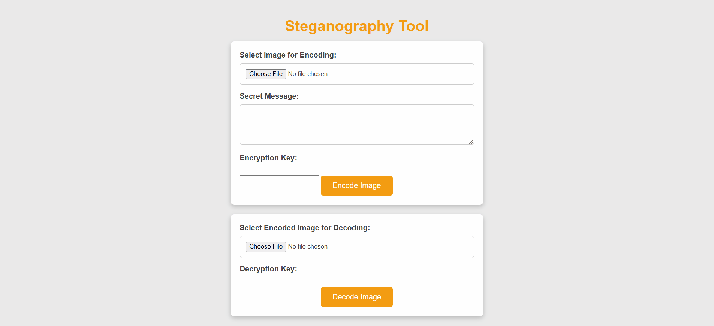
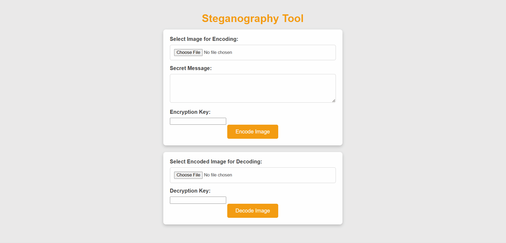

# Introduction

This tool application is just a toy project I made to learn more about the security and image APIs from Java and is not
intended for storing serious or personal data (do so at your own risk).

The application lets you secretly encode secret messages into images using a custom key. These images can then be shared
to others for a secure and wacky communication method or stored locally to hide some secrets (maybe your cake recipe
🎂👀).

It also uses a "hidden seed" stored in the application configuration file. So even if someone finds your images and
keys, they still need the seed to decrypt the data.

It is easy to start and use the application, you can follow the steps below. You can also clone the project directly
into an IDE like IntelliJ and start the project.

# Running the Application

### Prerequisites

1. **Java 21** installed on your machine.
    - Verify with: `java -version`
2. **Maven** installed if not using an IDE.
    - Verify with: `mvn -version`

### Code to run the app from command line

1. **Clone the repository** using git

```bash
git clone https://github.com/livcristi/steganography-tool.git
```

2. **Build the Project** using Maven to compile and package the application

```bash
mvn clean package
```

3. **Run the application** using java

```bash
java -jar target/image-hider.jar
```

4. **Access the application** with a browser

Open a browser and go to `http://localhost:7770` (you can change the port in the application.yml config file)

### Demo

You can encode an image by uploading it to the form, then adding a secret message and a key. You then press
the `Encode Image` button and the image will be processed and downloaded in your default Downloads directory.


The decoding part is easy and similar. You just upload an image which already contains a secret, together with its key
and press `Decode Image`. The message should appear on the bottom of the page.

